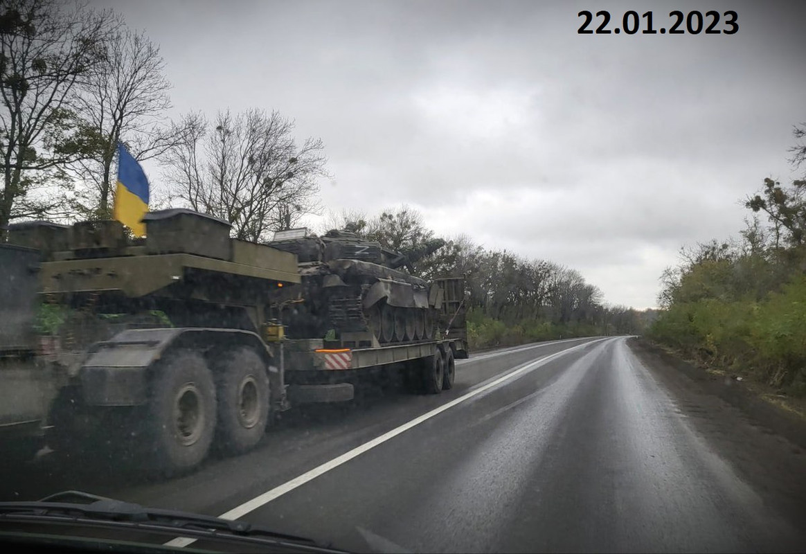
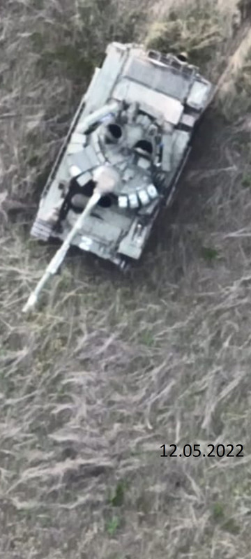

```{r setup, include=FALSE}
knitr::opts_chunk$set(echo = TRUE)
library(tidyverse)
```

## R Markdown

This is an R Markdown document. Markdown is a simple formatting syntax
for authoring HTML, PDF, and MS Word documents. For more details on
using R Markdown see <http://rmarkdown.rstudio.com>.

When you click the **Knit** button a document will be generated that
includes both content as well as the output of any embedded R code
chunks within the document. You can embed an R code chunk like this:

Remarques préliminaires : Les données récoltées sont issues d'images ou
vidéos, le plus souvent prises par drone, postées publiquement sur des
réseaux sociaux tels que X (anciennement Twitter) ou Telegram, puis
analysées par des passionnés d'OSINT (Open Source INTelligence). Son
travail est d'excellente qualité, suffisamment pour être reconnu comme
tel par David Howell Petraeus, ancien général américain et directeur de
la CIA sous la première administration Obama, ou être cité dans des
grands médias comme Reuters ou la BBC. Cependant les données présentent
des limitations. De part la méthodologie d'Oryx, seules les pertes ayant
une preuve visuelle sont comptabilisées. Cela implique que certaines
pertes ne sont pas enregistrées et qu'il s'agit d'une estimation basse
des pertes réelles.

Total des pertes visuellement confirmées de MBT (détruits, abandonnés,
capturés ou endommagés) par pays entre le 24/02/2022 et le 07/04/2025
dans la guerre Russo-Ukrainienne.

```{r}
totals_by_type <- read.delim("OryxData/totals_by_type.csv",sep = ",")
  
total_tank_losses <- totals_by_type %>% 
  filter(grepl('Tanks', equipment_type)) %>%
  filter(!grepl('Losses', equipment_type))
  
total_tank_losses
```

Ensemble de toutes les pertes visuellement confirmées entre le
24/02/2022 et le 07/04/2025 dans la guerre Russo-Ukrainienne.

```{r}
all_vehicles <- read.delim("OryxData/totals_by_system.csv",sep = ",")

all_vehicles
```

Avant d'aller plus loin, il est important de définir ce qu'est un MBT
(Main Battle Tank ou char de bataille, communément appelé tank ou char
d'assaut). Un MBT est un véhicule lourdement blindé et armé d'un canon
principal et d'au moins une mitrailleuse. Son rôle sur le champ de
bataille et d'offrir un soutient à l'infanterie en étant le fer de lance
lors de assaut pour permettre une percée des lignes de défense ennemies,
ainsi que l'exploitation de ces percées, c'est à dire profiter de sa
mobilité pour prendre de cours les lignes ennemis en les attaquants par
les flancs ou par l'arrière ou encore en perturbant les lignes
d'approvisionnement, pour forcer l'ennemi à abandonner ses positions et
reculer. Concrètement cela se traduit par un blindage permettant de
faire face à la plupart des armes ennemies, un canon permettant
d'engager les autres blindés et les poches de résistance, comme un
bunker ou un nid de mitrailleuse et des sous-systèmes d'acquisition
d'information et de communication permettant une bonne coopération avec
les forces alliées au travers d'une bonne conscience situationnelle.

Il a été décidé de répartir les différents modèles de MBT en fonction de
leur niveau de modernité dans quatre catégories (colonne age): -
obsolete : le modèle ne peut pas remplir son rôle. Cela peut s'expliquer
par un blindage ou un armement peu efficace ou un manque de
sous-systèmes modernes (optiques thermiques commandant et tireur de
deuxième génération ou plus, conduite de tir automatisée, commandes
tireurs dédoublées pour le commandant de char, DAL (Détecteur d'Alerte
Laser), ...) - old : le modèle peine à remplir son rôle. Cela vient de
sous-systèmes datés et donc moins performant, voir du manque de certains
sous-systèmes aujourd'hui jugé critique. Ca se traduit le plus souvent
par un manque de conscience situationnelle. - modern : le modèle remplit
correctement son rôle. Il jouit de sous-systèmes modernes voir dernière
génération tels que des optiques thermiques de troisième génération pour
le commandant et le tireur. - unknown : l'identification n'est pas assez
précise pour déterminer le modèle exacte.

Une autre catégorisation qui est déjà faite par le jeu de donnée est le
"status". Puisqu'il n'est question ici que de pertes avec une preuve
visuelle et que toutes les pertes ne se valent pas, le matériel est
classé dans l'une des quatres catégories suivantes :

-   captured : l'équipement a été récupéré par le camp adverse



-   abandonned : montre des signes d'abandons, souvent en combinaison
    avec des dégâts. L'équipement abandonné dans une zone sûre controlée
    par seulement l'un des deux camps ne figure pas dans ce jeu de
    donnés



-   damaged : l'équipement a été endommagé au delà de ce qui est
    rapidement / facilement réparable


-   destroyed : l'équipement est détruit à tel point qu'il n'est pas
    réparable, ou du moins pas d'une façon économiquement viable,
    autrement dit il est moins cher d'en reconstruire un neuf du même
    modèle ou d'en réactiver un, en fonction de si il s'agit d'un modèle
    encore en production ou issu des stocks légués par l'URSS.


source : méthodologie Oryx
<https://x.com/Rebel44CZ/status/1878490738243068330>

Découpage en sous tables des MBT de la série T (conception soviétique)
en fonction des grandes familles de modèles :

-   T-50 (T-54, T55): reliques du passé, conception du début des années
    50

-   T-60 (T-62, T-64): obsolètes, conception du début des années 60

-   T-72 : table redécoupée plus loin en fonction du niveau de
    modernisation, conception de la fin des années 60

    -   Note : les PT-91 sont une variante modernisée polonaise du T72,
        d'où leur inclusion ci-dessous

-   T-80 : table redécoupée plus loin en fonction du niveau de
    modernisation, conception repartant de la base du T-60 datant de la
    fin des années 70

-   T-90 : table redécoupée plus loin en fonction du niveau de
    modernisation, conception repartant de la base du T-72 et
    incorporant des sous-systèmes du T-80 datant de la fin des années
    80, tous les modèles ont été construit après la dissolution de
    l'URSS en 1991.

```{r}
all_Tseries_without_battalion_number <- all_vehicles %>%
  mutate(system = sub("[0-9]*", "", system)) %>%
  filter(grepl('T-[5-9]|PT-91', system)) 

T50_tanks <- all_Tseries_without_battalion_number %>%
  filter(grepl('T-5', system)) %>%
  mutate(system_family = 'T-50 serie') %>%
  mutate(age = 'obsolete')

T60_tanks <- all_Tseries_without_battalion_number %>%
  filter(grepl('T-6', system)) %>%
  mutate(system_family = 'T-60 serie') %>%
  mutate(age = 'obsolete')

T72_tanks <- all_Tseries_without_battalion_number %>%
  filter(grepl('T-72|PT-91', system)) %>%
  mutate(system_family = 'T-72 serie') %>%
  mutate(age = 'obsolete')

T80_tanks <- all_Tseries_without_battalion_number %>%
  filter(grepl('T-8', system)) %>%
  mutate(system_family = 'T-80 serie') %>%
  mutate(age = 'old')

T90_tanks <- all_Tseries_without_battalion_number %>%
  filter(grepl('T-90', system)) %>%
  mutate(system_family = 'T-90 serie') %>%
  mutate(age = 'old')

all_Tseries_without_battalion_number
T50_tanks
T60_tanks
T72_tanks
T80_tanks
T90_tanks
```

Découpage en sous tables des modèles de la famille des T72 :

```{r}
T72_obsolete <- T72_tanks %>%
  filter(grepl('A|B|Ural', system)) %>%
  filter(!grepl('Obr.|B3|EA', system))

T72_old <- T72_tanks %>%
  filter(grepl('1989|M|EA', system)) %>%
  filter(!grepl('AMT|Unknown', system)) %>%
  mutate(age = 'old')

T72_modern <- T72_tanks %>%
  filter(grepl('2014|2022|B3|PT', system)) %>%
  mutate(age = 'modern')

T72_unknown <- T72_tanks %>%
  filter(grepl('Unknown', system)) %>%
  mutate(age = 'unknown')

T72_obsolete
T72_old
T72_modern
T72_unknown
```

Découpage en sous tables des modèles de la famille des T80

```{r}
T80_old <- T80_tanks %>%
  filter(grepl('B|U', system)) %>%
  filter(!grepl('BVM|2022|UD', system))

T80_modern <- T80_tanks %>%
  filter(grepl('BVM|2022|UD', system)) %>%
  mutate(age = 'modern')

T80_unknown <- T80_tanks %>%
  filter(grepl('Unknown', system)) %>%
  mutate(age = 'unknown')

T80_old
T80_modern
T80_unknown
```

Découpage en sous tables des modèles de la famille des T90

```{r}
T90_old <- T90_tanks %>%
  filter(grepl('A|S', system))

T90_modern <- T90_tanks %>%
  filter(grepl('M', system)) %>%
  mutate(age = 'modern')

T90_unknown <- T90_tanks %>%
  filter(grepl('Unknown', system)) %>%
  mutate(age = 'unknown')

T90_old
T90_modern
T90_unknown
```

Table contenant tous les MBT qui ne sont pas de la série T (conception
OTAN)

```{r}
all_NATO_without_battalion_number <- all_vehicles %>%
  mutate(system = sub("[0-9]*", "", system)) %>%
  filter(!grepl('Russia|Soviet Union', origin)) %>%
  filter(grepl('Leopard|Abrams|Challenger|Stridsvagn',system)) %>%
  filter(!grepl('mine-clearing|Recovery',system)) %>%
  mutate(system_family = 'NATO') %>%
  mutate(age = 'modern')

NATO_MBT_old <- all_NATO_without_battalion_number %>%
  filter(grepl('Leopard 1', system)) %>%
  mutate(age = 'old')

NATO_MBT_modern <- all_NATO_without_battalion_number %>%
  filter(!grepl('Leopard 1', system))

all_NATO_without_battalion_number
NATO_MBT_old
NATO_MBT_modern
```

Graphiques en barres des totaux par grande famille de blindés et par
pays(tous les chars OTAN sont comptés comme faisant partie de la même
famille du fait de leurs petits effectifs) et des totaux par niveau de
modernisation et par pays

```{r}

all_MBTs <- NATO_MBT_modern %>%
  union(T72_modern) %>%
  union(T80_modern) %>%
  union(T90_modern) %>%
  union(NATO_MBT_old) %>%
  union(T72_old) %>%
  union(T80_old) %>%
  union(T90_old) %>%
  union(T50_tanks) %>%
  union(T60_tanks) %>%
  union(T72_obsolete) %>%
  union(T72_unknown) %>%
  union(T80_unknown) %>%
  union(T90_unknown)

all_MBTs$status <- factor(all_MBTs$status, levels = c("captured", "abandoned", "damaged", "destroyed"))
all_MBTs$age <- factor(all_MBTs$age, levels = c("modern", "old", "obsolete", "unknown"))

totals_by_family <- all_MBTs %>%
  ggplot() +
  geom_bar(mapping = aes(x=system_family, fill = country), stat = "count", width = 0.5)
  
totals_by_age <- all_MBTs %>%
  ggplot() +
  geom_bar(mapping = aes(x=age, fill = country), stat = "count", width = 0.5) 

totals_by_age_proportion <- all_MBTs %>%
  ggplot(aes(age, fill = country)) +
  geom_bar(position = "fill") +
  scale_y_continuous(name = "percent",
                     breaks = seq(0, 1, by = 0.1),
                     labels = scales::percent_format())

totals_by_country_by_age <- all_MBTs %>%
  ggplot() +
  geom_bar(mapping = aes(x=country, fill = age), stat = "count", width = 0.90) +
  scale_fill_manual(
    values = c("modern" = "#4fc3f7", "old" = "#ba68c8", "obsolete" = "#d32f2f", "unknown" = "#A0A0A0"),
    breaks = c("modern", "old", "obsolete", "unknown"),
    name = "Age Category"
  )

totals_by_country_by_age_proportion <- all_MBTs %>%
  ggplot(aes(country, fill = age)) +
  geom_bar(position = "fill") +
  scale_y_continuous(name = "percent",
                     breaks = seq(0, 1, by = 0.1),
                     labels = scales::percent_format()) +
  scale_fill_manual(
    values = c("modern" = "#4fc3f7", "old" = "#ba68c8", "obsolete" = "#d32f2f", "unknown" = "#A0A0A0"),
    breaks = c("modern", "old", "obsolete", "unknown"),
    name = "Age Category"
  )

all_MBTs
totals_by_family
totals_by_age
totals_by_age_proportion
totals_by_country_by_age
totals_by_country_by_age_proportion
```

Graphiques des pertes visuellement confirmées par mois ou par années et
par pays

```{r}
all_MBTs_losses_per_month <- all_MBTs %>%
  # On exclus le  mois d'avril car il n'est pas terminé et pourrait biaiser l'impression faite au lecteur
  filter(!grepl('2025-04', date_recorded)) %>%
  mutate(date_recorded = sub('.{3}$','',date_recorded))

all_MBTs_losses_per_year <- all_MBTs_losses_per_month %>%
  # On exclue l'année 2025 car elle n'est pas terminée et pourrait biaiser l'impression faite au lecteur
  filter(!grepl('2025', date_recorded)) %>%
  mutate(date_recorded = sub('.{3}$','',date_recorded))

all_MBTs_losses_per_month_relative <- all_MBTs_losses_per_month %>%
  ggplot(aes(date_recorded, fill = country)) +
  geom_bar(position = "fill", width = 0.65) +
  scale_y_continuous(name = "percent",
                     breaks = seq(0, 1, by = 0.1),
                     labels = scales::percent_format()) + 
  theme(axis.text.x = element_text(angle = 90, vjust = 0.5, hjust=1))

totals_losses_by_month <- all_MBTs_losses_per_month %>%
  ggplot() +
  geom_bar(mapping = aes(x=date_recorded, fill = country), stat = "count", width = 0.5) + 
  theme(axis.text.x = element_text(angle = 90, vjust = 0.5, hjust=1))

#all_equipment_totals_losses_by_month <- all_vehicles %>%
#  filter(!grepl('2025-04', date_recorded)) %>%
#  mutate(date_recorded = sub('.{3}$','',date_recorded)) %>%
#  ggplot() +
#  geom_bar(mapping = aes(x=date_recorded, fill = country), stat = "count", width = 0.5) + 
#  theme(axis.text.x = element_text(angle = 90, vjust = 0.5, hjust=1))#

totals_losses_by_year <- all_MBTs_losses_per_year %>%
  ggplot() +
  geom_bar(mapping = aes(x=date_recorded, fill = country), stat = "count", width = 0.5) 

#all_equipment_totals_losses_by_month
all_MBTs_losses_per_month
all_MBTs_losses_per_month_relative
totals_losses_by_month
totals_losses_by_year
```

Graphiques de la ditribution des pertes visuellement confirmées en
fonction de la tranche d'age

```{r fig.align="center", fig.width = 10}
distribution_losses_per_age_and_per_month <- all_MBTs_losses_per_month %>%
  ggplot(aes(date_recorded, fill = age)) +
  geom_bar(position = "fill", width = 0.65) +
  scale_y_continuous(name = "percent",
                     breaks = seq(0, 1, by = 0.1),
                     labels = scales::percent_format()) +
  scale_fill_manual(
    values = c("modern" = "#4fc3f7", "old" = "#ba68c8", "obsolete" = "#d32f2f", "unknown" = "#A0A0A0"),
    breaks = c("modern", "old", "obsolete", "unknown"),
    name = "MBT generation"
  ) + 
  theme(axis.text.x = element_text(angle = 90, vjust = 0.5, hjust=1))
  
distribution_losses_per_age_and_per_month
```

Graphiques de la distribution des types de pertes visuellement
confirmées par mois

```{r fig.align="center", fig.width = 10}
distribution_losses_by_status_per_month <- all_MBTs_losses_per_month %>%
  ggplot(aes(date_recorded, fill = status)) +
  geom_bar(position = "fill", width = 0.65) +
  scale_y_continuous(name = "percent",
                     breaks = seq(0, 1, by = 0.1),
                     labels = scales::percent_format()) +
  scale_fill_manual(
    values = c("captured" = "#3f1fb9", "abandoned" = "#4fc3f7", "damaged" = "#ba68c8", "destroyed" = "#d32f2f"),
    breaks = c("captured", "abandoned", "damaged", "destroyed"),
    name = "Status"
  ) + 
  theme(axis.text.x = element_text(angle = 90, vjust = 0.5, hjust=1))

distribution_losses_by_status_per_month
```

Une hypothèse que nous pouvons raisonnablement proposer est que le
niveau de modernité des MBT à une influence sur les pertes.

Graphiques des totaux de pertes par catégorie d'âge et de la
distribution des types de pertes visuellement confirmées en fonction de
la catégorie d'âge

```{r}
totals_losses_by_age <- all_MBTs %>%
  ggplot() +
  geom_bar(mapping = aes(x=age), stat = "count", width = 0.5) 

distribution_losses_by_age_and_by_status <- all_MBTs %>%
  ggplot(aes(age, fill = status)) +
  geom_bar(position = "fill", width = 0.65) +
  scale_y_continuous(name = "percent",
                     breaks = seq(0, 1, by = 0.1),
                     labels = scales::percent_format()) +
  scale_fill_manual(
    values = c("captured" = "#3f1fb9", "abandoned" = "#4fc3f7", "damaged" = "#ba68c8", "destroyed" = "#d32f2f"),
    breaks = c("captured", "abandoned", "damaged", "destroyed"),
    name = "Status"
  ) + 
  theme(axis.text.x = element_text(angle = 90, vjust = 0.5, hjust=1))

distribution_losses_by_age_and_by_status2 <- all_MBTs %>%
  group_by(age) %>%
  count(status) %>%
  mutate(percent = n/sum(n)) %>% 
  select(-n) %>%
  ggplot(aes(x=status, fill=age, y=percent))+
  geom_col() + 
  facet_grid(~age) +
  coord_cartesian(ylim = c(0,1)) +
  scale_y_continuous(name = "percent",
                     breaks = seq(0, 1, by = 0.1),
                     labels = scales::percent_format()) +
  xlab("Status") +
  ggtitle("Distribution of reported status for each MBT generation") +
  scale_fill_manual(
    values = c("modern" = "#3f1fb9", "old" = "#4fc3f7", "obsolete" = "#ba68c8", "unknown" = "#d32f2f"),
    breaks = c("modern", "old", "obsolete", "unknown"),
    name = "Generation"
  ) + 
  theme(axis.text.x = element_text(angle = 90, vjust = 0.5, hjust=1))

totals_losses_by_age
distribution_losses_by_age_and_by_status
distribution_losses_by_age_and_by_status2

```
