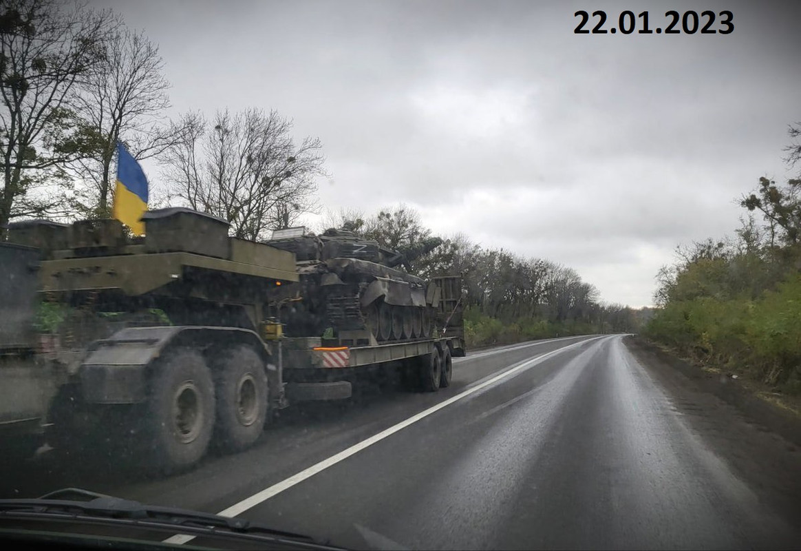
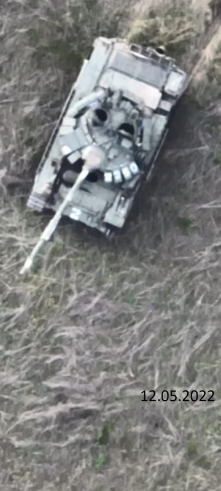
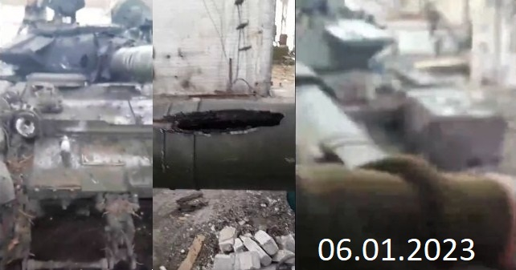
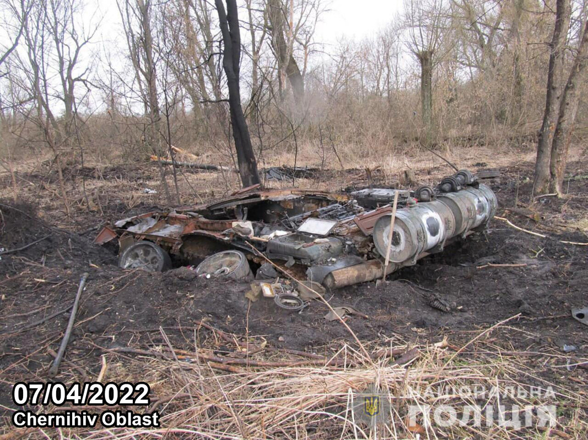

```{r setup, include=FALSE}
knitr::opts_chunk$set(echo = TRUE)
```

```{r echo=FALSE, include=FALSE}
library(tidyverse)
library(kableExtra)
options(tibble.print_max = Inf)
```

```{r echo=FALSE, include=FALSE}
totals_by_type <- read.delim("./OryxData/totals_by_type.csv",sep = ",")
totals_by_system <- read.delim("./OryxData/totals_by_system.csv",sep = ",")
all_vehicles <- totals_by_system
```

# Introduction

## Contexte

Depuis le début de l'invasion de l'Ukraine par la Russie en février 2022, de nombreuses sources tentent de documenter les pertes militaires des deux camps. Parmi elles, le collectif indépendant Oryx propose une base de données visuelle et systématique des équipements militaires perdus. Leur méthodologie repose sur des preuves visuelles publiquement disponibles (photos, vidéos géolocalisées), complétées dans de très rares cas par des confirmations officielles du pays ayant subit la perte.

Le répertoire Github duquel nous tirons nos données au format CSV est géré par Daniel P. Scarnecchia, chercheur à la Harvard Humanitarian Initiative (HHI). Il dirige les travaux sur les normes et l’éthique au sein du Signal Program on Human Security and Technology. Son domaine
d'expertise est l'impact de la technologie en contexte de crise, l’éthique de la donnée et les pratiques de recherche fondées sur des preuves réelles dans le secteur humanitaire. Ce répertoire enregistre quasi quotidiennement les mises à jour du site Oryx, qui ne permet hélas pas de récupérer ses données en CSV, d'où le passage par cet intermédiaire.

Le Harvard Humanitarian Initiative, rattaché à l'École de Santé Publique T.H. Chan, est un centre interdisciplinaire dont l’objectif est de réduire les souffrances humaines en zones de guerre ou de catastrophe, par la recherche appliquée, la formation, et l’élaboration de stratégies humanitaires plus efficaces et respectueuses des droits humains.

### Problématique: Comment évoluent les pertes de chars d'assaut durant l'invasion Russe en Ukraine ?

### Description de l'ensemble de données

Le jeu de données utilisé dans cette étude est directement issu de ces inventaires rigoureux. Notre choix s'est porté sur 2 tables:

**total_by_system.csv** : Détaille chaque observation individuelle d’équipement perdu avec leur nom complet, le pays d’origine, le statut (détruit, abandonné, capturé, endommagé), et un lien vers la preuve visuelle.

**totals_by_type.csv** : Recense un aggrégat des types d'équipements (char, avions, véhicules d'infanteries, etc.) par pays, toujours avec le statut associé à la perte.

Elles nous permettent d'extraire avec précision les tanks recherchés par leurs intitulés, et ainsi générer différents graphiques qui sépare les valeurs possibles des données en classes (intervalle de valeurs prises par un caractère quantitatif) ou groupes.

### Limites du jeu de données

Les données présentent des limitations: elles sont conservatrices par nature, car seules les pertes confirmées visuellement sont comptabilisées, ce qui sous-estime assurément les pertes réelles, malgré la présence de téléphones portables ou de drones sur le champ de bataille. Toutefois, la rigueur méthodologique d'Oryx garantit un niveau de fiabilité élevé sur les données recensées et l'analyse qui en a été faite. Comme évoqué plus haut, les sources d'Oryx sont des images ou vidéos, le plus souvent prises par drone, postées publiquement sur des réseaux sociaux tels que X (anciennement Twitter) ou Telegram, puis analysées par des passionnés d’OSINT (Open Source INTelligence). Leur travail est d’excellente qualité, suffisamment pour être reconnu comme tel par David Howell Petraeus, ancien général américain et directeur de la CIA sous la première administration Obama, ou être cité dans de grands médias comme Reuters ou la BBC. De par la méthodologie d’Oryx, seules les pertes ayant une preuve visuelle permettant de déterminer qu'elles ont bien eu lieu après le début de l'invasion russe et sur les territoires contestés sont comptabilisées.

Autre aspect important, seules les pertes sont prises en compte et sans contexte cela peut déformer la réalité ou à minima amener à des conclusions éronnées. Bien qu'elles donnent une vague idée des quantités de matériels déployé et de la composition des différentes armées, tout les systèmes d'armes n'ont pas la même vulnérabilité. Cela va dépendre des caractéristiques intrinsèques du matériel, des compétences de son équipage, de son utilisation, des quantités dans lesquels il a été déployé et de tout un tas d'autres facteurs externes. Aussi, il ne faut pas prendre ces données seules comme un reflet du nombre de pièces d'équipement déployées et garder à l'esprit que le matériel obsolète est probablement sur-représenté.

## Objectif de l'étude

Cette étude vise à analyser l’évolution des pertes de chars d’assaut au cours du conflit russo-ukrainien. En particulier, elle cherche à mettre en évidence les tendances temporelles de ces pertes et à les corréler avec des événements historiques autour du conflit (offensives majeures,
contre-attaques, annonces stratégiques, etc).

# Méthodologie

## Procédures de nettoyage des données

Avant d'aller plus loin, il est important de définir ce qu'est un MBT (Main Battle Tank ou char de bataille, communément appelé tank ou char d'assaut). Un MBT est un véhicule lourdement blindé, armé d'un canon principal et d'au moins une mitrailleuse. Son rôle sur le champ de bataille et d'offrir un soutien à l'infanterie en étant le fer de lance lors des assauts pour permettre une percée des lignes de défense ennemies. Il doit également exploiter ces percées, c'est à dire profiter de sa mobilité pour prendre de cours les lignes ennemis en les attaquants par les flancs ou par l'arrière ou encore en perturbant les lignes d'approvisionnement, pour forcer l'ennemi à abandonner ses
positions et reculer. Concrètement cela se traduit par un blindage permettant de faire face à la plupart des armes ennemies, un canon permettant d'engager les autres blindés et les poches de résistance, comme un bunker ou un nid de mitrailleuse et des sous-systèmes d'acquisition d'information et de communication permettant une bonne coopération avec les forces alliées au travers d'une bonne conscience situationnelle.

Tout d'abord, l'ensemble des pertes visuellement confirmées de MBT (détruits, abandonnés, capturés ou endommagés) par pays entre le 24/02/2022 et le 07/04/2025 dans la guerre Russo-Ukrainienne est regroupé. Cela permet par la suite de nous assurer de la cohérence de nos calculs et observations futurs.

```{r}
total_tank_losses <- totals_by_type %>% 
  filter(grepl('Tanks', equipment_type)) %>%
  filter(!grepl('Losses', equipment_type))

# Reformater pour affichage
formatted_table <- total_tank_losses %>%
  select(-equipment_type) %>%
  pivot_longer(
    cols = -country,
    names_to = "Status",
    values_to = "Count"
  ) %>%
  pivot_wider(
    names_from = country,
    values_from = Count
  ) %>%
  relocate(Status)

# Affichage tableau
formatted_table %>%
  kable(caption = "Pertes totales de chars par type de statut") %>%
  kable_styling(bootstrap_options = c("striped", "hover", "condensed"), full_width = FALSE)
```

Les pertes visuellement confirmées, ont montré un ratio de pertes de chars russes par rapport aux pertes ukrainiennes qui s'est maintenu au-dessus de 3 pour 1 pendant une grande partie du conflit.

Il a été décidé de répartir les différents modèles de MBT en fonction de leur niveau de modernité, et par conséquent leur capacité à remplir le rôle qui leur incombe, dans quatre catégories (colonne age). Cette répartition a été faite par nos soins, sur la base des critères suivants :

-   *survivabilité* : cela prend en compte la protection passive (blindage, DAL (Détecteur d'Alerte Laser) et système de fumigène automatique, silhouette, agencement des munitions, mobilité, systèmes de lutte anti-incendie automatique) et active (système de protection active, blindage
réactif explosif, brouilleurs d'ondes, ...)

-   *armement* : calibre du canon principal, munitions compatibles, capacité d'emport des munitions, type et génération de la conduite de tir

-   *acquisition d'information et communication* : présence d'optiques infrarouges et/ou thermiques et génération, présence d'un viseur panoramique indépendant de la tourelle et surclassement des commandes de la tourelle par le commandant de char, présence d'un télémètre laser, sous-systèmes de communication (radio, téléphone, autre), capteurs divers et variés (thermomètre, anémomètre, baromètre, ...)

-   *autre* : ergonomie des intérieurs, fiabilité des sous-systèmes, autonomie (principalement dictée par la capacité d'emport en carburant et consommation)

Les quatres catégories sont les suivantes :

-   **obsolete** : le modèle ne peut pas remplir son rôle. Cela peut s'expliquer par un blindage ou un armement peu efficace ou un manque de sous-systèmes modernes (optiques thermiques commandant et tireur de deuxième génération ou plus, conduite de tir automatisée, commandes tourelles dédoublées pour le commandant de char, DAL, ...)

-   **old** : le modèle peine à remplir son rôle. Cela vient de sous-systèmes datés et donc moins performant, voir du manque de certains sous-systèmes aujourd'hui jugé critique. Ca se traduit le plus souvent par un manque de conscience situationnelle.

-   **modern** : le modèle remplit correctement son rôle. Il jouit de sous-systèmes modernes voir dernière génération tels que des optiques thermiques de troisième génération pour le commandant et le tireur.

-   **unknown** : l'identification n'est pas assez précise pour déterminer le modèle exacte.

Une autre catégorisation qui est déjà faite par le jeu de donnée est le **"status"**. Puisqu'il n'est question ici que de pertes avec une preuve visuelle et que toutes les pertes ne se valent pas, le matériel est classé dans l'une des quatres catégories suivantes :

-   **captured** : l'équipement a été récupéré par le camp adverse

    

-   **abandonned** : montre des signes d'abandons, souvent en combinaison avec des dégâts. L'équipement abandonné dans une zone sûre controlée par seulement l'un des deux camps ne figure pas dans ce jeu de donnés.

    

-   **damaged** : l'équipement a été endommagé au delà de ce qui est rapidement / facilement réparable.

    

-   **destroyed** : l'équipement est détruit à tel point qu'il n'est pas réparable, ou du moins pas d'une façon économiquement viable, autrement dit il est moins cher d'en reconstruire un neuf du même modèle ou d'en réactiver un, en fonction de si il s'agit d'un modèle encore en production ou issu des stocks légués par l'URSS.

    

Découpage en sous tables des MBT de la série T (conception soviétique) en fonction des grandes familles de modèles :

-   **T-50 (T-54, T55)**: reliques du passé, conception du début des années 50

-   **T-60 (T-62, T-64)**: obsolètes, conception du début des années 60

-   **T-72** : table redécoupée plus loin en fonction de sa génération, conception de la fin des
    années 60

    -   Note : les PT-91 sont une variante modernisée du T72 polonaise, d'où leur inclusion
        ci-dessous

-   **T-80** : table redécoupée plus loin en fonction de sa génération, conception repartant de la
    base du T-60 datant de la fin des années 70

-   **T-90** : table redécoupée plus loin en fonction de sa génération, conception repartant de la
    base du T-72 et incorporant des sous-systèmes du T-80 datant de la fin des années 80, tous les
    modèles ont été construit après la dissolution de l'URSS en 1991.

```{r}
all_Tseries_without_battalion_number <- all_vehicles %>%
  mutate(system = sub("[0-9]*", "", system)) %>%
  filter(grepl('T-[5-9]|PT-91', system)) 

T50_tanks <- all_Tseries_without_battalion_number %>%
  filter(grepl('T-54|T-55', system)) %>%
  mutate(system_family = 'T-50 serie') %>%
  mutate(age = 'obsolete') 

T60_tanks <- all_Tseries_without_battalion_number %>%
  filter(grepl('T-62|T-64', system)) %>%
  # On retire les variantes dédiées au déminage
  filter(!grepl('mine', system)) %>%
  mutate(system_family = 'T-60 serie') %>%
  mutate(age = 'obsolete')

T72_tanks <- all_Tseries_without_battalion_number %>%
  filter(grepl('T-72|PT-91', system)) %>%
  # On retire les variantes lance-missile multiples
  filter(!grepl('MRLS', system)) %>%
  mutate(system_family = 'T-72 serie') %>%
  mutate(age = 'obsolete')

T80_tanks <- all_Tseries_without_battalion_number %>%
  filter(grepl('T-80', system)) %>%
  mutate(system_family = 'T-80 serie') %>%
  mutate(age = 'old')

T90_tanks <- all_Tseries_without_battalion_number %>%
  filter(grepl('T-90', system)) %>%
  mutate(system_family = 'T-90 serie') %>%
  mutate(age = 'old')
```

Découpage en sous tables des modèles de la famille des T72 :

```{r}
T72_obsolete <- T72_tanks %>%
  filter(grepl('A|B|Ural|T-72', system)) %>%
  filter(!grepl('Obr.|2022|B3|EA|Unknown|AMT|M/', system))

T72_old <- T72_tanks %>%
  filter(grepl('1989|M|EA', system)) %>%
  filter(!grepl('AMT', system)) %>%
  mutate(age = 'old')

T72_modern <- T72_tanks %>%
  filter(grepl('2014|2022|B3|PT', system)) %>%
  mutate(age = 'modern')

T72_unknown <- T72_tanks %>%
  filter(grepl('Unknown', system)) %>%
  mutate(age = 'unknown')


All_T72 <- T72_obsolete %>%
  union (T72_old) %>%
  union (T72_modern) %>%
  union (T72_unknown)
```

Découpage en sous tables des modèles de la famille des T80:

```{r}
T80_old <- T80_tanks %>%
  filter(grepl('B|U', system)) %>%
  filter(!grepl('BVM|2022|UD|Unknown', system))

T80_modern <- T80_tanks %>%
  filter(grepl('BVM|2022|UD', system)) %>%
  mutate(age = 'modern')

T80_unknown <- T80_tanks %>%
  filter(grepl('Unknown', system)) %>%
  mutate(age = 'unknown')

all_T80 <- T80_old %>%
  union(T80_modern) %>%
  union(T80_unknown)
```

Découpage en sous tables des modèles de la famille des T90:

```{r}
T90_old <- T90_tanks %>%
  filter(grepl('A|S', system))

T90_modern <- T90_tanks %>%
  filter(grepl('M', system)) %>%
  mutate(age = 'modern')

T90_unknown <- T90_tanks %>%
  filter(grepl('Unknown', system)) %>%
  mutate(age = 'unknown')

all_T90 <- T90_old %>%
  union(T90_modern) %>%
  union(T90_unknown)
```

Table contenant tous les MBT qui ne sont pas de la série T (conception OTAN)

```{r}
all_NATO_without_battalion_number <- totals_by_system %>%
  mutate(system = sub("[0-9]*", "", system)) %>%
  filter(!grepl('Russia|Soviet Union', origin)) %>%
  filter(grepl('Leopard|Abrams|Challenger|Stridsvagn',system)) %>%
  filter(!grepl('mine-clearing|Recovery',system)) %>%
  mutate(system_family = 'NATO') %>%
  mutate(age = 'modern')

NATO_MBT_old <- all_NATO_without_battalion_number %>%
  filter(grepl('Leopard 1', system)) %>%
  mutate(age = 'old')

NATO_MBT_modern <- all_NATO_without_battalion_number %>%
  filter(!grepl('Leopard 1', system))

all_NATO_MBT <- NATO_MBT_old %>%
  union(NATO_MBT_modern)
```

Reconstruction d'une table contenant tous les MBT

```{r}
all_MBTs <- all_NATO_MBT %>%
  union(all_T90) %>%
  union(all_T80) %>%
  union(All_T72) %>%
  union(T50_tanks) %>%
  union(T60_tanks)

all_MBTs$status <- factor(all_MBTs$status, levels = c("captured", "abandoned", "damaged", "destroyed"))
all_MBTs$age <- factor(all_MBTs$age, levels = c("modern", "old", "obsolete", "unknown"))
```

1.  Évolution temporelle des pertes par grande famille 
    
    Hypothèse : La distribution des pertes en fonction des grandes familles de MBT est-elle uniforme et a-t-elle évolué pendant le conflit ?

```{r echo=FALSE}
# 1) Calculer les pertes journalières totales par famille, par pays
all_MBTs <- NATO_MBT_modern %>%
  union(T72_modern) %>%
  union(T80_modern) %>%
  union(T90_modern) %>%
  union(NATO_MBT_old) %>%
  union(T72_old) %>%
  union(T80_old) %>%
  union(T90_old) %>%
  union(T50_tanks) %>%
  union(T60_tanks) %>%
  union(T72_obsolete) %>%
  union(T72_unknown) %>%
  union(T80_unknown) %>%
  union(T90_unknown)

time_series <- all_MBTs %>%
  mutate(date_recorded = as.Date(date_recorded)) %>%
  group_by(country, system_family, date_recorded) %>%
  summarise(pertes = n(), .groups = "drop") %>%
  arrange(country, system_family, date_recorded) %>%
  group_by(country, system_family) %>%
  mutate(cum_pertes = cumsum(pertes)) %>%
  ungroup()

# 2) Filtrer les données de la Russie
rus_time_series <- time_series %>%
  filter(country == "Russia")

# 3) Filtrer les données de l'Ukraine
ukr_time_series <- time_series %>%
  filter(country == "Ukraine")

# 4) Définir une palette cohérente
famille_couleurs <- c(
  "T-50 serie" = "#1f77b4",
  "T-60 serie" = "#ff7f0e",
  "T-72 serie" = "#2ca02c",
  "T-80 serie" = "#d62728",
  "T-90 serie" = "#9467bd",
  "NATO" = "#F0E442"
)

# 5) Graphique pour la Russie
ggplot(rus_time_series, aes(x = date_recorded, y = cum_pertes, color = system_family)) +
  geom_line(linewidth = 1) +
  scale_color_manual(values = famille_couleurs) +
  labs(
    title = "Tendance des pertes cumulées des chars russes par famille (2022–2024)",
    x = "Date",
    y = "Pertes cumulées",
    color = "Famille"
  ) +
  theme_minimal() +
  theme(axis.text.x = element_text(angle = 45, hjust = 1))

# 6) Graphique pour l'Ukraine
ggplot(ukr_time_series, aes(x = date_recorded, y = cum_pertes, color = system_family)) +
  geom_line(linewidth = 1) +
  scale_color_manual(values = famille_couleurs) +
  labs(
    title = "Tendance des pertes cumulées des chars ukrainiens par famille (2022–2024)",
    x = "Date",
    y = "Pertes cumulées",
    color = "Famille"
  ) +
  theme_minimal() +
  theme(axis.text.x = element_text(angle = 45, hjust = 1))
```

**Analyse:** Au début du conflit, une grande quantité de T-72 est déployée, étant donné le fait qu'il s'agit du principal cheval de bataille de l'armée russe, ce modèle ayant été produit dans d'immenses quantités par l'URSS entre 1973 et 1990. Le fait que le T-72, un char très répandu dans l'inventaire russe, ait subi des pertes importantes dès les premières semaines a également eu une signification particulière. Cela laissait présager le rôle essentiel que les vastes stocks de l'ère soviétique joueraient pour soutenir le conflit, car la flotte opérationnelle moderne de la Russie s'est avérée insuffisante et s'est réduit à un rythme inquiétant. Les pertes précoces de ce modèle suggère que la Russie a sous-estimé la résilience de l'Ukraine, orientant le conflit vers une guerre plus longue et plus coûteuse. La phase initiale de l'invasion a été marquée par des tentatives russes d'avancées rapides, de longs convois et des efforts pour s'emparer rapidement de villes et d'infrastructures clés, qui ont en majorité échoué. Cela a conduit à de nombreuses confrontations dans des environnements variés : champs ouverts, routes, zones urbaines et suburbaines. Les pertes élevées précoces des T-72 ont servi à démontré que l'armée russe, malgré sa taille et le nombre de ses équipements, n'était pas préparée à un conflit de haute intensité, contesté technologiquement, contre un adversaire déterminé et bien équipé\*. De nombreux chars issus des stocks étaient en mauvais état, nécessitant des réparations importantes ou n'étant utilisables que pour des pièces détachées. Les variantes plus anciennes manque des systèmes de protection et de conduite de tir les plus récents, ce qui en fait des cibles plus faciles. Les pannes mécaniques dues à l'âge et à un mauvais entretien peuvent entraîner l'abandon des véhicules, qui sont le plus souvent capturés ou détruits par la suite. On voit que la tendance change à la fin de l'année 2022, le conflit commençant à stagner. Dès lors les pertes augmentent de façon à peu près constante, témoignant de l'installation d'une guerre de position.
La contre-offensive ukrainienne a officiellement débuté début juin 2023, après des mois de préparation. Ses objectifs principaux étaient de percer les lignes défensives russes, en particulier dans le sud (Oblasts de Zaporijjia et de Donetsk), visant des localités stratégiques comme Melitopol et Berdiansk afin de couper le pont terrestre de la Russie vers la Crimée.

Les alliés occidentaux se sont engagés à fournir une gamme de MBT modernes, notamment des Leopard 2 allemands, des Challenger 2 britanniques et des M1 Abrams américains. Les promesses et les livraisons étaient en cours avant et pendant la mi-2023. En janvier 2023, plus de 300 chars occidentaux avaient été promis. Les chiffres spécifiques livrés à la mi-2023 comprenaient des lots de Leopard 2A4 et 2A6 de divers partenaires européens, et des Challenger 2 du Royaume-Uni. Les chars Abrams étaient attendus pour l'automne 2023, avec des livraisons de la variante M1A1 accélérées. Les premiers chars Leopard 2 sont arrivés en Ukraine vers février/mars 2023, les Challenger 2 arrivant également fin mars 2023. Cela signifie que ces équipements ont été intégrés aux forces ukrainiennes dans les mois précédant et pendant la phase initiale de la contre-offensive.

\*L'armée ukrainienne était en 2022 en cours de modernisation, en réaction à l'annexion de la Crimée et aux soulèvements dans le Donbass en 2014. Elle avait notamment acheté du matériel anti-char moderne aux puissances occidentales. Cependant il y a encore de fortes disparités aux seins des forces ukrainiennes, entre des brigades équipées de matériel dernière génération occidental et d'autre de surplus soviétique remontant aux années 60.

```{r}
totals_by_family <- all_MBTs %>%
  ggplot() +
  geom_bar(mapping = aes(x=system_family, fill = country), stat = "count", width = 0.5)
  
totals_by_age <- all_MBTs %>%
  ggplot() +
  geom_bar(mapping = aes(x=age, fill = country), stat = "count", width = 0.5) 

totals_by_country_by_age <- all_MBTs %>%
  ggplot() +
  geom_bar(mapping = aes(x=country, fill = age), stat = "count", width = 0.90) +
  scale_fill_manual(
    values = c("modern" = "#4fc3f7", "old" = "#ba68c8", "obsolete" = "#d32f2f", "unknown" = "#A0A0A0"),
    breaks = c("modern", "old", "obsolete", "unknown"),
    name = "MBT Generation"
  )

totals_by_country_by_age_proportion <- all_MBTs %>%
  ggplot(aes(country, fill = age)) +
  geom_bar(position = "fill") +
  scale_y_continuous(name = "percent",
                     breaks = seq(0, 1, by = 0.1),
                     labels = scales::percent_format()) +
  scale_fill_manual(
    values = c("modern" = "#4fc3f7", "old" = "#ba68c8", "obsolete" = "#d32f2f", "unknown" = "#A0A0A0"),
    breaks = c("modern", "old", "obsolete", "unknown"),
    name = "MBT Generation"
  )

totals_by_country_by_age
totals_by_country_by_age_proportion
```

2.  Parts relatives des statuts de perte (destroyed/damaged/abandoned/captured) 
    
    Hypothèse : La composition de chaque armée a eu un impact sur les types de pertes des MBT (par pays ou par famille).

```{r}
# 1. Préparer le découpage par status
status_breakdown <- all_MBTs %>%
  group_by(country, status) %>%
  summarise(count = n(), .groups = "drop") %>%
  complete(country, status, fill = list(count = 0)) %>%
  group_by(country) %>%
  # 2. Calculer la part en pourcentage
  mutate(
    total_country = sum(count),
    pct = if_else(total_country > 0, count / total_country, 0),
    label = if_else(
      pct > 0,
      paste0(round(pct * 100, 1), "%"),
      ""                    
    )
  ) %>%
  ungroup()

# 3. Tracer les camemberts
ggplot(status_breakdown, aes(x = 1, y = pct, fill = status)) +
  geom_col(width = 1, color = "white") +
  coord_polar(theta = "y") +
  # 4. Ajouter les labels de pourcentage centrés dans chaque tranche
  geom_text(aes(label = label),
            position = position_stack(vjust = 0.5),
            size = 3, color = "white") +
  facet_wrap(~ country) +
  labs(
    title = "Répartition des statuts de perte pour les chars",
    fill = "Statut"
  ) +
  theme_void() +
  theme(
    strip.text = element_text(face = "bold"),
    plot.title = element_text(hjust = 0.5)
  )
```

__Analyse:__

__1. Pour la Russie :__

**Composition mixte avec une part significative de chars modernes :** La Russie dispose d'une proportion notable de chars "modernes" (40%), tels que les T-90M et les versions les plus récentes des T-72B3 et T-80BVM. Cela indique que, malgré les pertes, la Russie déploie une partie de ses équipements les plus performants. Cependant, elle conserve également une part importante de chars "obsolètes" (23%) et "vieux" (20%), ce qui est cohérent avec les rapports indiquant que la Russie puise massivement dans ses stocks de l'ère soviétique pour compenser ses pertes.

**Statut des pertes et rôle offensif :** Le fait que 60,6% des chars russes soient "détruits" et 16,8% "capturés" reflète l'intensité des combats et le rôle offensif de la Russie. Les chars, qu'ils soient modernes ou plus anciens, sont exposés à des menaces importantes. Les pertes élevées des chars modernes, sont attribuées à l'efficacité des défenses ukrainiennes et des armes antichars. La proportion de chars "obsolètes" et "vieux" parmi les pertes russes est également élevée, car ces véhicules sont intrinsèquement plus vulnérables aux systèmes antichars modernes en raison de leur blindage moins efficace et de l'emplacement de leurs munitions (comme le T-72).

__2. Pour l'Ukraine :__

**Composition majoritairement obsolète et vieille:** La flotte de chars ukrainienne est dominée par les catégories "obsolète" (67%) et "vieux" (20%). Cela s'explique par son inventaire initial de l'ère soviétique (principalement des T-64 et T-72)  et par les livraisons occidentales qui ont inclus des modèles plus anciens comme le Leopard 1A5. La part de chars "modernes" (10%) est beaucoup plus faible, mais elle est constituée de chars de l'OTAN (Leopard 2, Challenger 2, M1 Abrams).

**Statut des pertes et rôle défensif/contre-offensif :** Les pourcentages de statut des pertes pour l'Ukraine sont très similaires à ceux de la Russie (63% "détruits", 13,2% "endommagés", 14,4% "capturés", 9,3% "abandonnés"). Cela suggère que, malgré les différences de composition et de rôle (l'Ukraine étant souvent en défense, mais ayant mené une contre-offensive majeure à la mi-2023), le champ de bataille est extrêmement létal pour les chars des deux côtés. La forte proportion de chars "obsolètes" et "vieux" dans la flotte ukrainienne signifie que ces modèles sont plus susceptibles d'être détruits en raison de leur protection limitée face aux armes antichars russes. Les pertes de chars "modernes" de l'OTAN, bien que moins nombreuses en valeur absolue, sont notables compte tenu des quantités limitées livrées et de leur durabilité accrue.


La composition de chaque armée a un impact direct sur les types de chars perdus (c'est-à-dire la proportion de chars "modernes", "vieux" ou "obsolètes" parmi les pertes). Une armée avec une plus grande proportion de chars obsolètes verra naturellement plus de ces chars détruits, et vice-versa pour les chars modernes.

Cependant, les statuts de perte (détruits, endommagés, capturés, abandonnés) sont remarquablement similaires pour les deux armées. Cela suggère que, quelle que soit la composition spécifique de la flotte, des facteurs tels que l'efficacité des armes antichars modernes (drones, missiles guidés), la densité des champs de mines et les rôles attaquant/défenseur semblent avoir un impact plus uniforme sur la manière dont les chars sont mis hors de combat, qu'ils soient russes ou ukrainiens, ou qu'ils soient de conception soviétique ou occidentale.

En somme, la composition de l'armée détermine quels modèles de chars sont disponibles pour le combat et donc quels types sont susceptibles d'être perdus, tandis que la nature du conflit et les capacités de l'adversaire influencent la manière dont ces pertes se produisent.


```{r}
total_tank_losses <- totals_by_type %>% 
  filter(grepl('Tanks', equipment_type)) %>%
  filter(!grepl('Losses', equipment_type))

total_destroyed_per_nation <- totals_by_system %>%
  dplyr::mutate(system = sub("^\\d+", "", system)) %>%
  dplyr::filter(grepl(' T-', system)) %>%
  dplyr::filter(grepl('destroyed', status)) %>%
  group_by(country)

total_damaged_per_nation <- totals_by_system %>%
  dplyr::mutate(system = sub("^\\d+", "", system)) %>%
  dplyr::filter(grepl(' T-', system)) %>%
  dplyr::filter(grepl('damaged', status)) %>%
  group_by(country)

total_captured_per_nation <- totals_by_system %>%
  dplyr::mutate(system = sub("^\\d+", "", system)) %>%
  dplyr::filter(grepl(' T-', system)) %>%
  dplyr::filter(grepl('captured', status)) %>%
  group_by(country)

total_abandoned_per_nation <- totals_by_system %>%
  dplyr::mutate(system = sub("^\\d+", "", system)) %>%
  dplyr::filter(grepl(' T-', system)) %>%
  dplyr::filter(grepl('abandoned', status)) %>%
  group_by(country)

# Fusion des totaux par état
df_tank_losses <- bind_rows(
  total_destroyed_per_nation %>% summarise(total = n()) %>% mutate(type = "Destroyed"),
  total_damaged_per_nation %>% summarise(total = n()) %>% mutate(type = "Damaged"),
  total_captured_per_nation %>% summarise(total = n()) %>% mutate(type = "Captured"),
  total_abandoned_per_nation %>% summarise(total = n()) %>% mutate(type = "Abandoned")
)
```

3.  Evolution des totaux de pertes sur un laps de temps donné au cours du conflit 
    
    Hypothèse : A-t-il eu une évolution du nombre de pertes sur une quantité de temps donnée au cours du conflit ?

Graphiques des pertes visuellement confirmées par mois ou par années et par pays

```{r}
all_MBTs_losses_per_month <- all_MBTs %>%
  # On exclus le  mois d'avril car il n'est pas terminé et pourrait biaiser l'impression faite au lecteur
  filter(!grepl('2025-04', date_recorded)) %>%
  mutate(date_recorded = sub('.{3}$','',date_recorded))

all_MBTs_losses_per_year <- all_MBTs_losses_per_month %>%
  # On exclue l'année 2025 car elle n'est pas terminée et pourrait biaiser l'impression faite au lecteur
  filter(!grepl('2025', date_recorded)) %>%
  mutate(date_recorded = sub('.{3}$','',date_recorded))

all_MBTs_losses_per_month_relative <- all_MBTs_losses_per_month %>%
  ggplot(aes(date_recorded, fill = country)) +
  geom_bar(position = "fill", width = 0.65) +
  scale_y_continuous(name = "percent",
                     breaks = seq(0, 1, by = 0.1),
                     labels = scales::percent_format()) + 
  theme(axis.text.x = element_text(angle = 90, vjust = 0.5, hjust=1)) + 
  xlab("Time (in month)") +
  ylab("Percentage of total losses") +
  ggtitle("Evolution of the repartition of losses per country and per month")

totals_losses_by_month <- all_MBTs_losses_per_month %>%
  ggplot() +
  geom_bar(mapping = aes(x=date_recorded, fill = country), stat = "count", width = 0.5) + 
  theme(axis.text.x = element_text(angle = 90, vjust = 0.5, hjust=1)) + 
  xlab("Time (in month)") +
  ylab("Number of visually confirmed losses") +
  ggtitle("Evolution of the number of losses per month")

all_equipment_totals_losses_by_month <- all_vehicles %>%
  filter(!grepl('2025-04', date_recorded)) %>%
  mutate(date_recorded = sub('.{3}$','',date_recorded)) %>%
  ggplot() +
  geom_bar(mapping = aes(x=date_recorded, fill = country), stat = "count", width = 0.5) + 
  theme(axis.text.x = element_text(angle = 90, vjust = 0.5, hjust=1))#

totals_losses_by_year <- all_MBTs_losses_per_year %>%
  ggplot() +
  geom_bar(mapping = aes(x=date_recorded, fill = country), stat = "count", width = 0.5) 

all_equipment_totals_losses_by_month
# all_MBTs_losses_per_month
all_MBTs_losses_per_month_relative
totals_losses_by_month
```
__Analyse:__

Nous allons ici nous pencher principalement sur le graphique "Evolution of the number of losses per month", car il permet une analyse plus fine des tendances de la guerre par rapport aux deux autres. On observe ici un motif en vague qui se répète avec plus ou moins d'intensité. Les pics
correspondent aux mois durant lesquels ont eu lieu les grandes offensives. Les creux sont des temps de plus faible intensité, qui servent à reconstituer les forces des deux côtés et à préparer la prochaine offensive majeure. On remarque que le premier mois est de loin le plus coûteux pour la Russie, dont les colonnes blindées ne s'attendaient pas à rencontrer une telle résistance. A l'inverse, le mois de mars 2024 est étonnamment calme. Ce mois a été particulièrement boueux, freinant les mouvements à toutes les échelles. De plus le mois précedant a été meurtrier, impliquant un temps de reconstitution des forces. Le mois d'après enregistre quant à lui le deuxième record de pertes mensuelles, ce qui signifie que le mois de mars a également été un mois de préparation pour d'intenses assauts. Ces assauts ayant pris place en avril et se prolongeant jusqu'à début mai sont en parti expliqués par le désir du Kremlin de pouvoir afficher des victoires lors de son défilé militaire annuel du 9 mai, à des fins de propagandes internes et externes. Exception fait des mois d'avril et mai 2024, on voit deux tendances se dessiner au fil du temps. Une première phase de guerre de mouvement s'étalant sur la majorité de l'année 2022, où les deux armées cherchaient à prendre l'initiative, au prix de lourdes pertes. Puis on observe une diminution suivi d'une stagnation du nombre de pertes par mois, indicatif du passage à une guerre de position, où ni la Russie, ni l'Ukraine n'ont réussi à saisir l'initiative. Cela débouche sur un renforcement et une
bétonisation des lignes de fronts, rendant les assauts et les avancés de grandes envergures de plus en plus ardus. Les offensives russes d'avril et mars 2024 ne porteront que de maigres résultats, surtout au vu des quantités de matériel perdu.

Le graphique "Evolution of the repartition of losses per country and per month" permet de déterminer qui était le plus sur l'offensive sur un mois donné. Comme dans toutes les guerres, l'attaquant enregistre proportionnellement aux effectifs de son armée plus de pertes que le défenseur. Ainsi, sur les mois où le total des pertes se partage plus équitablement entre la Russie et l'Ukraine, malgré la différence considérable d'effectifs, on peut en déduire que c'était l'Ukraine qui a mené le plus d'assauts. Cela arrive en juin 2023 par exemple, mois pendant lequel l'Ukraine a lancé une grande contre offensive sur l'ensemble de la ligne de front, principalement dans les oblasts de Donetsk et Zaporijjia.

4.  Evolution des proportions de générations de MBT et types de perte

    Hypothèse : Il y a une évolution et un lien entre le type de perte et les proportions de chaque génération de MBT.

```{r}
distribution_losses_per_age_and_per_month <- all_MBTs_losses_per_month %>%
  ggplot(aes(date_recorded, fill = age)) +
  geom_bar(position = "fill", width = 0.65) +
  scale_y_continuous(name = "percent",
                     breaks = seq(0, 1, by = 0.1),
                     labels = scales::percent_format()) +
  scale_fill_manual(
    values = c("modern" = "#4fc3f7", "old" = "#ba68c8", "obsolete" = "#d32f2f", "unknown" = "#A0A0A0"),
    breaks = c("modern", "old", "obsolete", "unknown"),
    name = "Generation"
  ) + 
  theme(axis.text.x = element_text(angle = 90, vjust = 0.5, hjust=1)) + 
  xlab("Status") +
  ggtitle("Distribution of MBT generation within losses per month")
  

distribution_losses_by_status_per_month <- all_MBTs_losses_per_month %>%
  ggplot(aes(date_recorded, fill = status)) +
  geom_bar(position = "fill", width = 0.65) +
  scale_y_continuous(name = "percent",
                     breaks = seq(0, 1, by = 0.1),
                     labels = scales::percent_format()) +
  scale_fill_manual(
    values = c("captured" = "#3f1fb9", "abandoned" = "#4fc3f7", "damaged" = "#ba68c8", "destroyed" = "#d32f2f"),
    breaks = c("captured", "abandoned", "damaged", "destroyed"),
    name = "Status"
  ) + 
  theme(axis.text.x = element_text(angle = 90, vjust = 0.5, hjust=1)) + 
  xlab("Time (in month)") +
  ggtitle("Distribution of reported status within losses per month")


distribution_losses_by_age_and_by_status_bars <- all_MBTs %>%
  ggplot(aes(age, fill = status)) +
  geom_bar(position = "fill", width = 0.65) +
  scale_y_continuous(name = "percent",
                     breaks = seq(0, 1, by = 0.1),
                     labels = scales::percent_format()) +
  scale_fill_manual(
    values = c("captured" = "#3f1fb9", "abandoned" = "#4fc3f7", "damaged" = "#ba68c8", "destroyed" = "#d32f2f"),
    breaks = c("captured", "abandoned", "damaged", "destroyed"),
    name = "Status"
  ) + 
  theme(axis.text.x = element_text(angle = 90, vjust = 0.5, hjust=1))

distribution_losses_by_age_and_by_status_columns <- all_MBTs %>%
  group_by(age) %>%
  count(status) %>%
  mutate(percent = n/sum(n)) %>% 
  select(-n) %>%
  ggplot(aes(x=status, fill=age, y=percent))+
  geom_col() + 
  facet_grid(~age) +
  coord_cartesian(ylim = c(0,1)) +
  scale_y_continuous(name = "percent",
                     breaks = seq(0, 1, by = 0.1),
                     labels = scales::percent_format()) +
  xlab("Status") +
  ggtitle("Distribution of reported status for each MBT generation") +
  scale_fill_manual(
    values = c("modern" = "#3f1fb9", "old" = "#4fc3f7", "obsolete" = "#ba68c8", "unknown" = "#d32f2f"),
    breaks = c("modern", "old", "obsolete", "unknown"),
    name = "Generation"
  ) + 
  theme(axis.text.x = element_text(angle = 90, vjust = 0.5, hjust=1))

distribution_losses_per_age_and_per_month
distribution_losses_by_status_per_month
# distribution_losses_by_age_and_by_status_bars
distribution_losses_by_age_and_by_status_columns
```
__Analyse:__

Le graphique *"Distribution of MBT generation within losses per month"* nous permet d'établir qu'il n'y a pas de tendance qui semble se dessiner pour le moment quant à la composition de la flotte de MBT des deux pays. Notons tout de même qu'il est peu probable qu'il n'y ait pas d'évolution substancielle dans les années à venir si la guerre venait à durer, les capacités de production des deux pays étant inférieur aux pertes dont ils souffrent. Les pertes ukrainiennes ont été en grande partie compensées par les dons de matériel des ex-membre du pacte de Varsovie, tandis que les russes ont pu compter sur les immenses stocks soviétiques dont ils ont hérité, mais ces solutions ne sont que temporaires et on devrait voir une réduction des totaux de MBT déployé, ce qui se traduirait par une baisse des pertes enregistrées, ainsi qu'une disparition des MBT "entre-deux", n'étant plus produit comme les chars plus modernes et ayant été retirés des stocks avant les modèles obsolètes.
A l'inverse, le graphique *"Distribution of reported status within losses per month"* montre clairement une évolution dans les proportions de status de pertes rapportées. Le début de la guerre comportant plus de grands mouvements a permis la capture de beaucoup d'équipement, mais le nombre de captures s'essoufle avec l'entrée dans une guerre plus statique. A l'opposé, le nombre de destruction augmente, ce qui s'explique probablement par l'évolution des tactiques anti-chars et la montée en compétence des équipages de drones ainsi que le minage toujours plus lourd des sols ukrainiens. Il ne semble cependant pas y avoir de rapport avec les légères variations de composition des deux forces blindées. Cela est confirmé par le troisième graphique, *"Distribution of reported status for each MBT generation"*, qui montre que la seule corrélation qui semble pertinente est que les pertes dont il n'a pas été possible de déterminer le modèle exact sont moins souvent capturées et plus souvent détruites. Une explication plausible est qu'il est plus simple d'identifier un véhicule qui a été capturé car il existe probablement plus de photos et de meilleures qualité que pour les autres types de pertes et qu'il est ardu d'identifier un char dont il ne reste plus grand chose.

# Conclusion

L'étude confirme que l'évolution des pertes de chars dans le conflit russo-ukrainien est un indicateur direct de la dynamique de la guerre. La composition des flottes, avec ses proportions de chars obsolètes, vieux et modernes, influence directement les types de véhicules qui sont mis hors de combat. Cependant, l'intensité du conflit, les tactiques employées (offensives contre défensives), l'efficacité des armements antichars modernes et les conditions du terrain sont des facteurs déterminants pour la manière dont ces pertes se manifestent, indépendamment de la génération des chars. L'épuisement des stocks, particulièrement pour la Russie, et la nécessité pour l'Ukraine de s'appuyer sur des donations, suggèrent que la composition future des flottes pourrait continuer à évoluer, avec des implications sur la nature des pertes à venir si le conflit devait se prolonger.

# References
**lien du dépôt GitHub:** https://github.com/scarnecchia/oryx_data

**Méthodologie Oryx:** https://x.com/Rebel44CZ/status/1878490738243068330

**Le Council on Foreign Relations:** 
https://www.cfr.org/global-conflict-tracker/conflict/conflict-ukraine
https://www.thefivecoatconsultinggroup.com/the-coronavirus-crisis/ukraine-context-d47

**hypothèses d'avant-guerre sur l'efficacité militaire russe et les capacités défensives ukrainiennes:**
https://www.thefivecoatconsultinggroup.com/the-coronavirus-crisis/ukraine-context-d47
https://kyivindependent.com/as-russian-tank-losses-in-ukraine-continue-to-mount-heres-what-you-need-to-know/

**Why have Russian tanks struggled in Ukraine?:** https://www.iwm.org.uk/history/why-have-russian-tanks-struggled-in-ukraine

**Russia’s T-72 Tank Is Getting Blown To Pieces in Ukraine:** https://nationalinterest.org/blog/buzz/russias-t-72-tank-getting-blown-pieces-ukraine-211292

**https://en.wikipedia.org/wiki/2023_Ukrainian_counteroffensive:** https://en.wikipedia.org/wiki/2023_Ukrainian_counteroffensive

**Tanks of the Ukrainian Army:**
https://en.wikipedia.org/wiki/Tanks_of_the_Ukrainian_Army

**Russia's war on Ukraine: Western-made tanks for Ukraine:**
https://www.europarl.europa.eu/RegData/etudes/ATAG/2023/739316/EPRS_ATA(2023)739316_EN.pdf

**How many tanks have Western countries provided to Ukraine?:**
https://www.army-technology.com/news/how-many-tanks-have-western-countries-provided-to-ukraine/?cf-view

**Military industrial complex and national military investment strategy:**
https://www.youtube.com/@PerunAU
